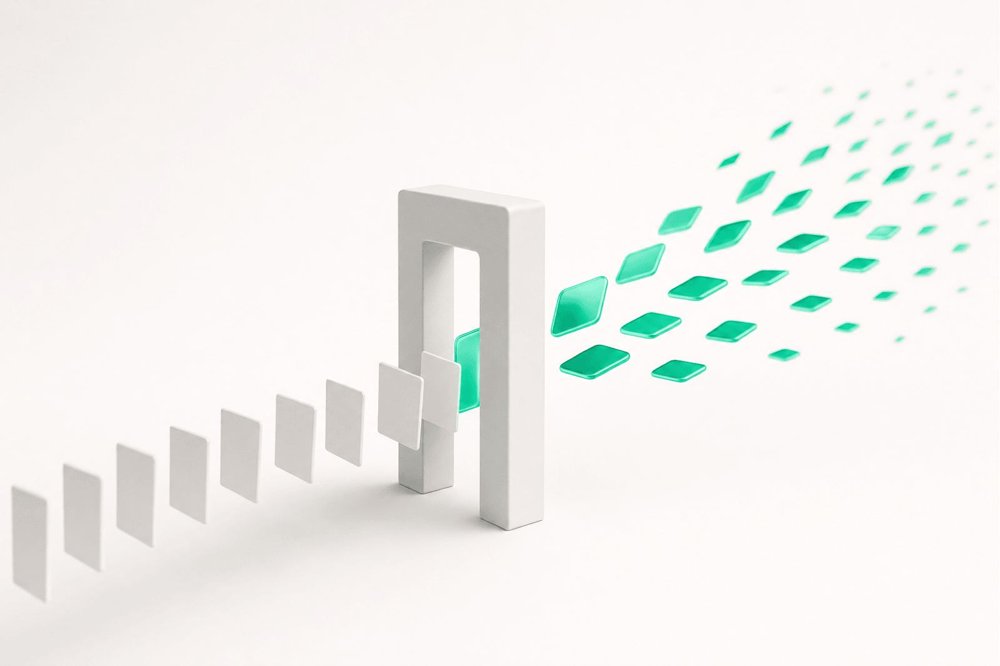
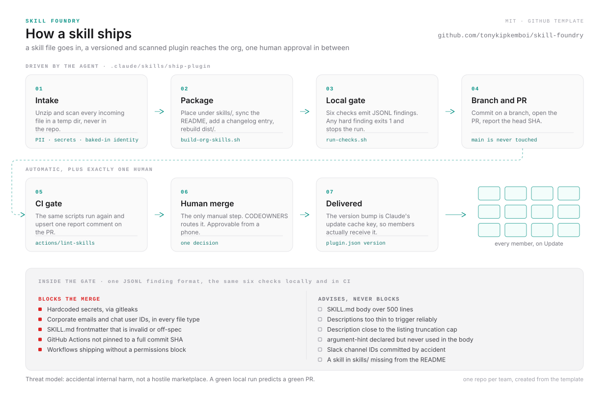

# Skill Foundry

  

**A governed pipeline for turning loose AI skill files into versioned, security-scanned,
org-distributed Claude plugins.** Teams write skills; this framework packages them,
gates them, and ships them, with one human approval and a paper trail.

This template is scaffolding informed by real enterprise practice: the kind of
pipeline that holds up when the people submitting skills aren't engineers.

## The problem this solves

AI skills (`SKILL.md` instruction files) are easy to write and dangerous to distribute
casually. Without a pipeline, orgs get: skills with employees' emails and tokens baked
in, "updates" that never reach users because nobody bumped a version, plugins whose
READMEs lie about their contents, reworks that sit unmerged for a month while everyone
believes they shipped, and a single person's laptop as the deployment substrate.

Skill Foundry replaces that with a repeatable loop:

<picture>
  <source media="(prefers-color-scheme: dark)" srcset="assets/pipeline-dark.svg">
  
</picture>

The loop is executed by an AI agent (Claude Code) following the **ship-plugin** skill in
`.claude/skills/ship-plugin/`, a playbook written so an agent with zero context gets it
right, with the human kept at exactly one decision point (the merge).

## What's in the box

| Piece | Where | What it does |
|-------|-------|--------------|
| Plugin template | `.claude-plugin/`, `skills/` (see `example-skill`), `dist/` | Standard Claude plugin layout: skills in, `.skill` packages out |
| Build | `scripts/build-org-skills.sh` | Validates frontmatter, rebuilds `dist/` packages; fails safe (never deletes on a bad build) |
| Policy gate | `.github/scripts/` + `run-checks.sh` | Secrets (gitleaks), PII (configurable domain), frontmatter validity, action pinning, workflow permissions, structure advisories. All findings come out as uniform JSONL; hard findings block |
| CI wiring | `.github/workflows/`, `.github/actions/lint-skills/` | The same gate runs on every PR; `check-dist` keeps packages in sync with source |
| Orchestrator skill | `.claude/skills/ship-plugin/SKILL.md` | The step-by-step packaging playbook an agent executes: preflight audit, intake guards, README sync, semver, end-state contract, run report |
| Template sync | `scripts/sync-from-template.sh` | Propagates machinery updates to repos created from this template without touching their skills/README/identity |
| Test harness | `tests/` | Fixture suite for every gate behavior, including runtime-generated secret fixtures (no secret-shaped strings are ever committed) |
| Benchmark | `docs/packaging-runlog.md` | Metric definitions + run log; the headline metric is "human-caught misses," target 0 |

## The short version

If you use Claude Code, the packaging playbook ships inside this repo
(`.claude/skills/ship-plugin/`), and Claude discovers it automatically. So the whole
workflow, once hosted, is: open the repo in Claude Code and say

> Package this skill file into this plugin and ship it: `~/Downloads/their-skill.skill`.
> Name the plugin `acme-general`.

The agent does the rest: placement, README, version, changelog, build, safety gate,
branch, PR. You review and merge. That works the same whether you are one person with
one plugin or a company running a fleet of department repos, each created from this
template with "Use this template."

## Quickstart (one plugin, ~15 minutes)

1. **Host the template.** Put this repo in your org (e.g. `YOUR-ORG/skill-foundry`) and
   set the placeholders: `TEMPLATE_REPO` in `scripts/sync-from-template.sh`, `CODEOWNERS`,
   and the author fields in `.claude-plugin/*.json`.
2. **Set your policy knobs** in `.github/scripts/policy-config.sh`: your corporate email
   domain for the PII gate, and (optionally) a shared tool-reference doc to auto-bundle.
3. **Create a plugin repo** from the template ("Use this template" on GitHub). One repo
   per team/department works well. In the new repo, swap READMEs: delete the framework
   `README.md` and rename `README.plugin.md` to `README.md` (ship-plugin's first-time
   setup walks through this).
4. **Open Claude Code inside the repo** and say:
   > Package this skill file into this plugin and ship it: `~/Downloads/their-skill.skill`.
   > Name the plugin `acme-general`.
   The ship-plugin skill drives everything: placement, README, version, changelog, build,
   gate, branch, PR. You review and merge.
5. **Register the plugin once** (org admin): your Claude organization settings -> Plugins
   -> Add plugins -> Sync from GitHub -> pick the repo. After this one-time step, merged
   version bumps flow to users automatically when they update the plugin.

Adding or updating skills later is the same sentence pointed at the same repo: no admin
step, just a merge. Requesters never need GitHub; they hand a `.skill` file to whoever
(or whatever) operates the pipeline.

## Five things you have to get right

1. **The version number is a delivery mechanism, not a label.** Claude uses the plugin
   `version` as its update cache key: no bump means users receive *nothing* when they
   update, even though your merge landed. MINOR = new skill, PATCH = fix, MAJOR =
   removed/renamed skill. The skill bumps it for you; the gate culture double-checks it.
2. **Hard gates block, soft gates advise, and noise is a bug.** Secrets, PII, invalid
   frontmatter, unpinned actions, missing workflow permissions: hard, merge-blocking.
   Style nudges: advisory. Every false positive or duplicated finding gets fixed at the
   gate level, because a gate people learn to skim protects nobody. The threat model is
   *accidental internal harm* (leaked credentials, shipped PII, broken structure), not
   adversarial marketplaces, so the gate stays small, fast, and quiet.
3. **Identity is runtime, not config.** A skill that bakes in one person's email, chat
   ID, or manager works only for that person and rots when they leave. Multi-user skills
   must derive "who is running me" at runtime. The intake guard flags violations.
4. **Slug and label are different things.** The plugin `name` slug is the command prefix
   and update key; it can never change after launch. The human-facing title lives in
   `displayName`. Set both at creation.
5. **The process must know what actually shipped.** The most damaging failure mode in
   any pipeline like this is "everyone believes it is live, and it isn't."
   ship-plugin's preflight audit (what is really on main? any stranded work?) and
   end-state contract (report the head SHA; say "final push done, safe to merge";
   verify main after merge) exist to make belief and reality converge.

## Operating it with an agent

The framework assumes an AI agent is the operator and is designed to keep that safe:

- The agent never pushes to `main`; everything is branch + PR, and CI re-validates.
- The gate is a hard stop: the skill forbids proceeding to commit/push/PR while
  `run-checks.sh` exits non-zero.
- Consequential choices (new plugin vs. update, ambiguous names, bump level) are
  explicit ask-the-human points, not judgment calls the agent makes silently.
- Every packaging PR ends with a **Run report** (Step 8): what was processed, what the
  gate found, whether the README sync was verified, and the headline metric:
  *human-caught misses this run* (target: 0). The benchmark accrues in PR bodies with
  zero extra infrastructure.

## Scaling up: the conveyor (roadmap)

Once one repo works, the same machinery extends to a fleet:

- **A service identity** (machine user / GitHub App) owns pushes and PRs, so the
  pipeline isn't tied to a person's laptop or personal SSO.
- **An intake front door** (a simple web form, or a Slack channel) lets non-technical
  teams submit skills without GitHub; a small server opens the intake PR on their behalf.
- **A headless packager** (Claude Code running in CI on intake-merge) executes
  ship-plugin and opens the plugin-repo PR automatically, failing closed to a draft PR
  plus a "needs a human" note on any anomaly.
- **One human merge** remains the only manual step, delegable to any team via
  CODEOWNERS and approvable from a phone.

None of that requires changing this template; it wraps it.

## Adopting checklist

- [ ] Template hosted in your org; placeholders set (`YOUR-ORG`, CODEOWNERS, authors)
- [ ] `policy-config.sh`: corporate domain set; shared-reference keywords set or left off
- [ ] Org GitHub settings: secret scanning + push protection on, Dependabot on
- [ ] First plugin repo created from template; gate green on a trial PR
- [ ] Plugin registered once in your Claude org settings (Sync from GitHub)
- [ ] `docs/packaging-runlog.md` baseline row after your first real run

## License

MIT (see `LICENSE`). Generic packaging machinery only: no proprietary skills, data, or
company references ship with this template.
